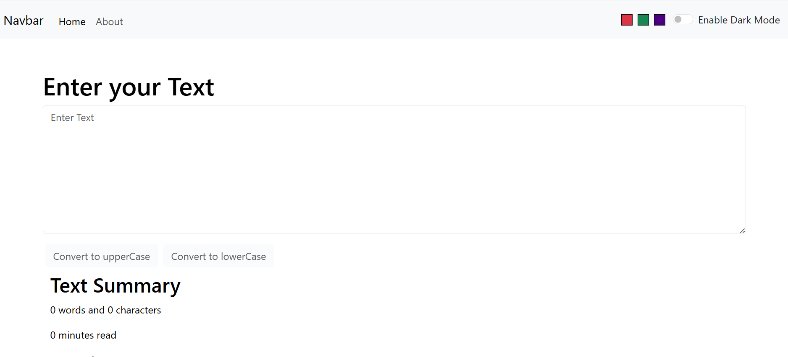

# TextUtils

TextUtils is a React-based text utility web application that helps users perform various text manipulation tasks quickly and efficiently.

## Features

- Convert text to UPPERCASE
- Convert text to lowercase
- Count words and characters
- Estimate reading time
- Live text preview

## Tech Stack

- React.js
- JavaScript
- Bootstrap
- HTML5
- CSS3

## Screenshots

### Main Interface



### Feature View


## Installation

### 1. Clone the repository

```bash
git clone https://github.com/Taahaomer/TextUtils.git
```

### 2. Navigate to the project folder

```bash
cd TextUtils
```

### 3. Install dependencies

```bash
npm install
```

## Running the Project

Start the development server:

```bash
npm start
```

The application will open in your browser at:

```text
http://localhost:3000
```

## Build for Production

Create an optimized production build:

```bash
npm run build
```

The production files will be generated inside the `build` folder.

## Available Scripts

### Start Development Server

```bash
npm start
```

### Run Tests

```bash
npm test
```

### Create Production Build

```bash
npm run build
```

### Eject Configuration

```bash
npm run eject
```

## Project Structure

```text
TextUtils/
│
├── public/
├── src/
│   ├── components/
|       ├── About.js
│       ├── Navbar.js
│       ├── ...
│   ├── App.js
│   ├── index.js
│   └── ...
│
├── package.json
├── package-lock.json
└── Assets
└── MIT Liscense
└── ...
```

## Contributing

Contributions are welcome.

1. Fork the repository
2. Create a new branch

```bash
git checkout -b feature-name
```

3. Commit your changes

```bash
git commit -m "Add feature"
```

4. Push to GitHub

```bash
git push origin feature-name
```

5. Open a Pull Request

## License

This project is licensed under the MIT License.

## Author

Taaha Omer

GitHub: https://github.com/Taahaomer
